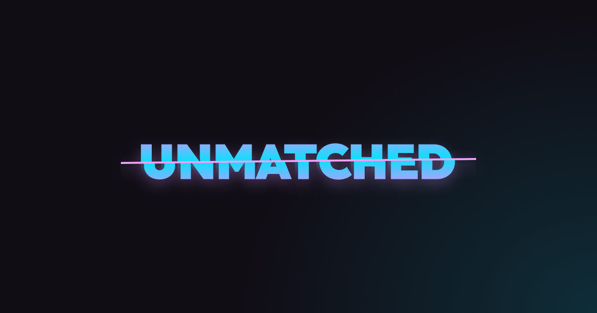

# Unmatched



A cooperative word-guessing party game inspired by **Just One**, built with React, TypeScript, and Firebase.

Each round, one player must guess a secret word using one-word clues from the other players — but duplicate clues are removed before the guesser sees them. Play 13 rounds and try to get the highest score!

## How It Works

The game uses a **big-screen / phone** pattern:

- **Big screen** (TV or computer) — hosts the lobby and displays the game state
- **Phones** — players join via a room code and submit clues or guesses from their devices

All state is synchronized in real-time through Firebase Realtime Database.

## Tech Stack

- **React 19** + **TypeScript** + **Vite**
- **Firebase Realtime Database** for multiplayer state
- **[react-gameroom](https://github.com/nicoara01/react-gameroom)** for room/lobby management
- **react-i18next** for internationalization (English & Portuguese)
- **React Router** for page navigation

## Getting Started

### Prerequisites

- Node.js 18+
- A Firebase project with Realtime Database enabled

### Install & Run

```bash
npm install
npm run dev
```

### Available Scripts

| Command           | Description                  |
| ----------------- | ---------------------------- |
| `npm run dev`     | Start the dev server         |
| `npm run build`   | Type-check and build for production |
| `npm run preview` | Preview the production build |
| `npm run test`    | Run tests once               |
| `npm run test:watch` | Run tests in watch mode   |
| `npm run lint`    | Lint with ESLint             |

## Game Rules

1. **3–8 players** join a room
2. Each round, a **secret word** is revealed to everyone except the guesser
3. All other players submit a **one-word clue**
4. **Duplicate clues are removed** — only unique clues are shown to the guesser
5. The guesser tries to figure out the secret word
6. **Scoring:** +1 for a correct guess, -1 for a wrong guess, 0 if the guesser passes
7. After **13 rounds**, the game ends and the final score is revealed

## Project Structure

```
src/
├── components/     # Game UI components (clues, guessing, scoring, etc.)
├── config/         # Firebase config, i18n setup, word banks
├── helpers/        # Pure game logic functions
├── hooks/          # Custom hooks (game state, Firebase room, etc.)
├── pages/          # Route pages (home, join, lobby, player, rejoin)
├── styles/         # CSS stylesheets
└── types/          # TypeScript type definitions
```
